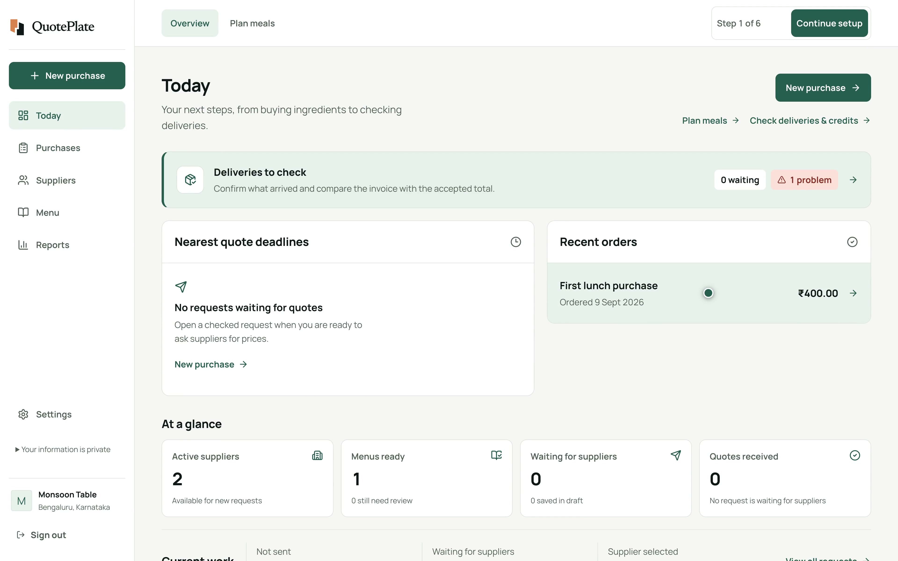

# QuotePlate

QuotePlate helps restaurants in India plan ingredient purchases, collect supplier quotes, compare costs, choose suppliers and check deliveries. Suppliers use private browser links to confirm business details, submit prices and respond to orders without creating a QuotePlate account.

[Hosted product](https://quoteplate.netlify.app) · Built by [Utsav Doshi](https://github.com/Utsavd7)

This README describes the current repository, including public Google onboarding, reviewed shopping lists and invoices, supplier website contacts, manual sharing and the shared workspace design. Availability on the hosted site depends on its deployed revision.

## Product demo

[](https://quoteplate.netlify.app/#watch-demo)

[Watch on the website](https://quoteplate.netlify.app/#watch-demo) · 2:45 · 4K, 3840 × 2400

The film follows the fictional Monsoon Table restaurant through Google signup choices, menu entry, reviewed shopping-list photos without a menu, published website contacts, manual sharing, supplier quotes on a phone, comparison and reviewed invoice billing before delivery checks. Short scenes introduce supplier workspaces, nearby discovery, meal planning, reports and repeat purchases. It uses condensed recordings of the app to cover the main feature families; the full feature reference is below.

[Transcript](public/media/quoteplate-product-film.txt) · [English captions](public/media/quoteplate-product-film.vtt) · [Media credits](public/media/credits.txt)

Media is served from `public/media`. The player starts muted when at least half visible, offers an explicit unmute control and optional captions, pauses offscreen, and respects manual pauses and reduced-motion preferences. The homepage buying journey has manually selected stages; old `/product` bookmarks redirect there.

## Product overview

The workspace works on phones, tablets and laptops. Restaurants keep control of contact review, quote requests, supplier selection and delivery records.

Restaurant pages share aligned content rails, titles, toolbars, controls and a fixed desktop sidebar. Supplier quote, application and workspace links share a responsive public shell. Fonts, weights and icon sizing use common tokens; the [workspace UI rules](docs/design/workspace-ui.md) describe the layout and accessibility conventions. Populated browser checks cover all primary restaurant pages at laptop and phone dimensions.

| Area | What you can do | Routes |
| --- | --- | --- |
| Today | See purchases needing attention; plan meals and portions, account for usable stock and confirmed arrivals, and turn shortages into a draft purchase. | `/dashboard`, `/service-planning` |
| Menu | Type dishes, read menu photos, transfer phone photos by QR, or import a permitted menu page. Review dishes and ingredients, organise categories, approve recipes, bulk-remove dishes and delete unused menus. | `/menus`, `/menus/[id]` |
| Your suppliers | Add or import contacts, review contacts published on a supplier website, maintain capabilities, review applications and find public supplier leads. | `/suppliers` |
| Purchases | Start from an approved menu or a reviewed typed/photo shopping list, edit requests, use existing or newly selected suppliers and/or accept applications, share private quote links, compare GST/freight-inclusive costs, and award the whole request or split items across suppliers. | `/procurement`, `/procurement/new`, `/procurement/[id]` |
| Orders & messages | Create supplier workspace links, read business declarations, share selected demand estimates, and review order acknowledgements and delivery responses. | `/supplier-collaboration` |
| Delivery record | Review fulfilment, rejected quantities, dated delivery evidence, billed cost per accepted unit and outstanding credits. Follow problems back to the purchase. | `/supplier-performance` |
| Past purchases and reports | Revisit requests, quotes, decisions and delivery checks; repeat an awarded purchase into a new draft; compare recorded supplier prices and spending. | `/history`, `/insights` |
| Settings and access | Maintain restaurant details, owner/member roles and invitation links; sign in/out and use the optional six-step setup guide. | `/settings`, `/signin`, `/start`, `/join` |
| Supplier pages | Apply to supply a restaurant, submit a private quote, or use a separate workspace link for business details and order responses. | `/supplier-application`, `/quote`, `/supplier-portal` |

Purchases include downloadable request, quote comparison, award and accounting CSVs, a private quote-link QR image, and a purchase order PDF for each awarded supplier. Owner permissions protect awards, supplier verification, restaurant settings and team access. `/intelligence` redirects to Reports at `/insights`.

## Start a restaurant workspace

Choose **Get started**, enter your restaurant details, and continue with a verified Google email. QuotePlate no longer requires an operator email allowlist. Existing users can still sign in with their configured account. Suppliers use private links and do not need Google or a QuotePlate account.

Google must be configured for the hosted origin and an external audience. Google Workspace administrators can impose their own restrictions. The code permits verified public onboarding; actual Google Console configuration and a new external account must be checked before claiming universal signup availability.

## Shopping lists and invoice review

In **New purchase**, type a list such as `Tomatoes 5 kg` or choose a printed-English photo. Review each suggested name, quantity and unit, correct unclear rows, then check and add the intended items. A menu is optional; list rows can also supplement selected menu ingredients. Normal purchase specifications, suppliers, dates and approval controls still apply.

In a purchase's delivery check, **Read invoice photo or text** helps review billed quantities and unit rates. Text such as `Tomatoes 5 kg @ 40` identifies an explicit rate. Only an exact awarded item name and unit can match, and you must check each suggestion before applying it. Existing billing entries are preserved. The helper does not infer physical receipts, tax, totals, credits or payments, and does not save the delivery check for you.

The currently selected photo stays visible beside editable text on wider screens and above it on phones, including during row review and manual correction. Replacing or closing a photo releases its local preview. Text can include earlier appended photos, so compare each row with its actual source.

Photos are read locally in the browser using bundled Tesseract.js; there is no paid OCR API or photo upload for these helpers. Recognition is intended for printed English, with a maximum 8 MB image and bounded dimensions. Unclear handwriting, tables, fractions, units and rates require manual correction. Pasted text is limited to 12,000 characters and 100 nonempty lines. The initial OCR download and processing depend on the device and connection.

## Supplier onboarding and manual sharing

### Start with existing contacts

In **Suppliers → Add existing contacts**, paste up to 50 lines of business name, phone and email, separated by commas or spreadsheet tabs, without column headings. Each row needs a name and at least a phone or email. Review, correct or remove rows before explicitly adding them. Duplicate contacts are checked after normalization; an import conflict rejects the whole batch and keeps the editable review. Existing records are not overwritten. Individual entry and full CSV import/export remain available.

Pasted contact reviews, nearby leads and website contacts flag matching phone numbers or emails among supplier records currently loaded. A shared contact is a warning, not proof that two businesses are the same; other pages or filtered-out records are not covered by this early warning. Server duplicate checks still apply when saving. Repeated website suggestions are compared after phone/email normalization while retaining the original published value, source and check time.

Adding contacts saves them for the restaurant; it does not invite or message anyone. Open **Workspace** beside an active supplier to select them in **Orders & messages**, where an owner can create their private workspace link.

### Review contacts from a supplier website

In a supplier form, open **Find contacts on the supplier’s website**, enter its public HTTPS address and choose **Check website**. QuotePlate checks a small number of pages on that same website, respecting supported robots rules and fetch limits. Published phone/email suggestions include a source link and check time. Review before applying; only empty fields are filled, and you still explicitly save the supplier.

This is contact assistance for a website you provide, not a complete supplier directory or business verification. No contacts are invented. An unavailable, blocked or contact-free website leaves manual entry available. Restaurant records are not sent to the supplier website.

### Share on WhatsApp, Email or Copy link

The same three controls appear with newly created private quotation links, supplier workspace links and new supplier application links:

- **Share on WhatsApp** opens a prepared message in the WhatsApp app or web experience available on the device. Choose the intended recipient and press **Send** from your own signed-in account. The quotation message names the purchase and asks the supplier to submit prices through the link.
- **Email** opens a prepared subject and message through the device/browser's default `mailto:` handler. This can be a configured mail app or registered webmail handler; QuotePlate does not choose Gmail or Outlook for you. A valid saved supplier email fills the recipient for quote and workspace links. Otherwise, including application links, choose the recipient yourself. Review and send in that mail handler; if none is configured, use **Copy link**.
- **Copy link** copies the URL for you to paste into a channel of your choice. It does not send a message.

Suppliers need a browser and their private link, not a QuotePlate login, email account or app installation, to quote. Replies made only in WhatsApp or email are not imported: suppliers must submit through QuotePlate for prices to appear in the comparison. Quote status shows link views and submitted quotes, not WhatsApp/email delivery or read receipts.

There is no WhatsApp Business API, central sender, connected mailbox or automatic invitation, reminder or order messaging. Share or copy private links before leaving the creation screen: their original secret cannot be retrieved later. Replace a lost link and share the new one. Supplier workspace links last 30 days and can be replaced or revoked; replacing one invalidates the previous link.

### Confirm supplier business details and respond to orders

The supplier workspace starts with **Confirm your business details**. It prefills the restaurant's saved contacts and categories until the supplier has a saved declaration. Suppliers review contact name, phone, WhatsApp number, email and product categories, then wholesale status, served PINs, minimum order, cutoff time in IST, lead time and notes. Confirmation needs at least one contact method and one category; email is optional. Suppliers can update details later and continue to their orders without completing this confirmation first.

The restaurant sees dated supplier declarations, with business details and delivery terms flagged for reconfirmation after 30 days. Older profiles remain readable, and stale submissions cannot overwrite a newer revision. Confirmation is a supplier statement for that restaurant: it does not independently verify the business, change the restaurant's address book or verification status, or establish marketing consent.

In the same workspace, suppliers can acknowledge their awarded orders, request changes, and agree with or dispute restaurant delivery checks using notes and textual document references. Earlier responses are retained; changed restaurant checks require renewed confirmation. Corrections stay in the restaurant's delivery check. This is structured order correspondence, with no file attachments or bank-verified settlement.

Owners can also share selected ingredient-shortage estimates from a saved future meal plan and withdraw them. Suppliers see only the selected purchasable quantities and specifications, without recipes, portions or stock counts. Estimates are not orders or arrival confirmations. Changed plans make snapshots outdated; past-service, converted or withdrawn estimates are hidden from suppliers.

## Nearby discovery and wider search

**Find suppliers in your area** resolves an Indian locality, city or PIN, then searches a selected category within 2, 5 or 10 km. Categories cover produce, dairy, meat, fish, dry groceries, spices and packaging. Up to 40 public leads show approximate straight-line distance, available contacts, website, map and original listing links.

Nearby lookup uses OpenStreetMap data through [Photon](https://github.com/komoot/photon) and the [VK Maps Overpass instance](https://maps.mail.ru/osm/tools/overpass/), with [OpenStreetMap attribution](https://www.openstreetmap.org/copyright). User-triggered requests send the area to Photon and selected coordinates, category and radius to VK Maps' service in Russia. Requests are bounded and rate-limited, with area matches cached for up to 24 hours and public results for up to one hour. The main `overpass-api.de` instance is not used.

A public email is included only when the OSM `email` or `contact:email` tag contains an accepted single address. It appears as plain contact text and enters the unsaved **Review and add** form. Invalid addresses, control characters and multiple addresses are rejected, without guessing contacts from names or websites. Missing email and older cached results remain usable. Source links and the **Unverified** label are retained.

Map entries are leads, not a verified supplier directory or live inventory. They may describe retailers, contain stale contacts or omit businesses entirely. Check products, capacity, delivery coverage and contacts yourself. Saving a map lead requires explicit confirmation that the restaurant checked it; “restaurant-verified” records that review, not certification by QuotePlate or OSM.

**Search other websites** builds external searches for Google Maps, Google Search, Justdial, IndiaMART, TradeIndia, ExportersIndia, Kompass and go4WorldBusiness. An optional configured Google Search Element can show combined results in an isolated frame after submission. Search terms go to the chosen provider; ads, sign-in requirements and external charges may apply. External results are not scraped or imported into the address book.

Nearby lookup and manual link sharing require no paid search or messaging integration in this implementation. Provider terms, limits and availability can change; hosting, database, storage and phone/data usage still cost money. There is no guarantee of free operation, complete coverage, verified contacts or successful supplier responses.

## Quotes and price-list assistance

Supplier quotes collect quantities, rates, GST, freight, availability, delivery details, substitutions and payment terms. Restaurants can compare complete and incomplete offers before the owner records a full or split award. Accepted prices, quantities, supplier facts and terms are preserved with the award.

On a private quote link, **Use a price list** accepts one JPEG, PNG or WebP photo, or pasted text. Photo reading is intended for clear printed English. Limits are 8 MB, 20 megapixels and 8,000 pixels per edge; pasted or recognized text is limited to 12,000 characters and 100 nonempty lines.

Suppliers review source text, matches, units and rates before choosing **Use checked prices**. Only blank eligible price fields are filled. Existing manual prices, quantities and GST choices stay as entered. Ambiguous matches, conflicting prices and incompatible units need correction; the helper does not invent or convert rates or units. Optional guided entry handles one item at a time, followed by delivery and total review and explicit quote submission.

**Go to first unfinished item** shows the number of incomplete item rows and focuses the first missing or invalid quantity, price or GST field in either entry mode. Zero prices and unavailable items follow the existing validation rules. It preserves entered values; delivery, combined totals and final submission still need review.

For repeat requests, suppliers can review and reuse their own earlier prices only for matching items, units and specifications. Historical prices are not live market prices; current quantities, availability and terms still need review and normal submission.

Price-list OCR runs locally in the supplier's browser using bundled assets, without a photo upload or paid AI service. Restaurant menu intake separately supports up to ten device photos, or a QR transfer of up to ten phone originals per batch; transferred photos use temporary encrypted copies. All detected menu text, dishes and ingredients need restaurant review. Cancelling menu reading now stops its owned worker even during startup; startup and each photo are bounded to 120 seconds, with manual entry available after failure.

## Planning, deliveries and purchase history

In **Today → Plan meals**, select an approved menu, enter portions and servings per recipe batch, then account for usable stock, expected yield and confirmed arrivals. For example, 10 kg required, 4 kg usable stock and 80% yield means buying 7.5 kg. Shared stock is allocated once, in dish order. Missing recipes, unknown stock, incompatible specifications and unsupported conversions block procurement rather than imply readiness. Arrivals are confirmed by the restaurant; there is no live inventory or availability integration.

Saved plans preserve approved recipe snapshots and reject stale edits. Converting shortages creates an editable procurement draft without contacting suppliers. Repeating a plan clears stock and arrival assumptions for the next service.

For each winning supplier, record received, rejected and billed quantities against their awarded allocation. Receipts and rejections are cumulative, including replacements; partial deliveries stay open. QuotePlate flags differences between the entered invoice total and accepted total and tracks credits claimed, received and still owed. These are entered delivery and financial records, with optional reviewed invoice assistance, not verified bank payments.

**Delivery record** uses the latest 100 awards for fulfilment, rejection, dated delivery evidence and credit balances. Capability suggestions can use established on-time evidence to break otherwise equal matches, requiring at least three dated completed deliveries in their bounded recent sample. Missing checks do not count as successful deliveries.

Billed cost per accepted unit uses only checks with entered billed quantity and rate. It includes GST under the accepted order's tax terms, excludes freight and order-level credits, and remains provisional for partial deliveries. Missing billed inputs and zero accepted quantity do not produce a misleading rate. Compatible mass/volume units normalize; differing specifications stay separate.

Follow-up lists link unchecked deliveries, remaining quantities and unsettled credits back to the purchase. A delivery date is not a credit due date. Correcting a check replaces its evidence rather than inventing another delivery. Past purchases can become new drafts; prior prices and performance guide the next decision without guaranteeing savings.

## Safety and privacy

- Restaurant workspaces are isolated. Suppliers see only their scoped quote/order records and explicitly shared estimates, not other suppliers' offers or the restaurant's recipes and stock.
- Quote and workspace links use separate expiring secrets stored as digests, with replacement and revocation controls. Treat the URLs as private access credentials.
- Owners control sensitive settings, team invitations, verification, awards and supplier workspace sharing. Rate limits protect account, invitation, supplier access and submission routes.
- Production validates security settings and the restricted database role. Browser policies limit framing, unnecessary device permissions and referrer disclosure.
- QR menu transfers use temporary encrypted copies; the decryption key stays in the QR link. Retrieved originals remain in that workspace on the current browser. Vendor price-list photos stay on the vendor's device.
- Choosing an external search or sharing handler sends the selected search terms or prepared message/link to that service. Check the recipient before sending a private link.
- Operator backup and restore checks are available in `scripts/backup-postgres.sh` and `scripts/restore-verify.sh`.

## Run locally

Requirements: Node.js 24 and PostgreSQL 16.

```bash
npm install
cp .env.sample .env
```

Replace `.env` placeholders with your own settings; never commit credentials. Use `NEXTAUTH_URL=http://localhost:3000` and a locally generated `NEXTAUTH_SECRET`. Google sign-in appears only when both Google client values are configured; its local callback is `http://localhost:3000/api/auth/callback/google`.

Apply all committed migrations using an operator connection that owns the database tables and has the required migration privileges. Supply that connection privately as `QUOTEPLATE_MIGRATION_URL` for this command:

```bash
DATABASE_URL="$QUOTEPLATE_MIGRATION_URL" npx prisma migrate deploy
```

The migrations create the restricted `autorfp_app` role. Configure its login credential separately and use its connection as the app's `.env` `DATABASE_URL`; never run the web app with the migration/owner connection. Then start:

```bash
npm run dev
```

Production owner creation uses a verified Google identity and explicit onboarding state; there is no operator email allowlist. Password-only owner creation is limited to development and the strictly loopback local test harness. Existing credential sign-in remains available.

### Optional combined supplier search

Configure a [Google Programmable Search Engine](https://programmablesearchengine.google.com/controlpanel/all) with supplier domains under **Sites to search**: `justdial.com`, `indiamart.com`, `tradeindia.com`, `exportersindia.com`, `in.kompass.com` and `go4worldbusiness.com`. Set its public `cx` ID as `NEXT_PUBLIC_SUPPLIER_SEARCH_ENGINE_ID` before building; rebuild after changing it.

The integration uses Google's ad-supported Search Element, not the JSON API; it has no search API-key setting. Verify provider eligibility and terms separately. It loads after an explicit search in an isolated frame without restaurant data or QuotePlate storage access. Without a configured engine, external searches and nearby OSM discovery still work.

## Production setup

1. Configure the runtime settings in `.env.sample`, including HTTPS origin, a restricted database connection, authentication secret and Google OAuth client settings. Set `QUOTEPLATE_RUNTIME_STARTUP_CHECK=1` only in the production server/function runtime, not public builds.
2. Apply **all** committed migrations with the operator connection before deploying. Current feature migrations include `20260907000100_service_planning`, `20260907000200_supplier_collaboration` and `20260908000100_supplier_trading_profile`.
3. Regenerate Prisma during installation/build, configure the production Google callback at `/api/auth/callback/google` and the appropriate external audience in Google Console, and deploy the tested revision.
4. Check `/api/health/live` and `/api/health/ready` before inviting restaurants. Readiness and restore checks require the updated schema; running local test migrations does not update production.

## Verification

```bash
npm test
npm run test:integration
npm run typecheck
npm run lint
npm run build
npm run test:components
npm run test:e2e
```

The [procurement validation report](docs/qa/2026-09-11-procurement-gaps.md) records the earlier release checks and loading baseline. The [loading and reliability report](docs/qa/2026-09-11-first-load-reliability.md) covers joined database reads, recovery after temporary role-check failures and bounded shared-read deadlines. The [workflow improvement report](docs/qa/2026-09-11-easier-workflows.md) covers account-bootstrap recovery, a combined Settings people read, supplier progress, contact warnings and local photo previews. First loading still depends on hosting, the database and the connection.

The [Google onboarding runbook](docs/qa/2026-09-11-google-onboarding.md) distinguishes verified OAuth initiation from a completed new-customer signup. Use the [one-restaurant trial kit](docs/trials/restaurant-first-purchase-trial.md) and [blank observation CSV](docs/trials/restaurant-first-purchase-observations.csv) to test one real purchase with 3–5 existing suppliers. The kit contains unsent invitations; no real trial has been completed.

The suites cover access control, tenant isolation, authentication, menu/OCR boundaries, supplier onboarding and sharing, nearby email extraction, quote integrity, costs, awards, delivery checks, repeat ordering, exports, responsive layouts, accessibility, migrations and a bounded twenty-restaurant load profile. Passing results must be established for the revision being released; this README is not a deployment or test-run report.

## Project references

- [Brand assets and usage](docs/brand/README.md)
- [India restaurant procurement review](docs/research/india-restaurant-procurement-competitive-review.md)
- [Unaided-user trial and operating cost notes](docs/research/2026-09-11-procurement-trial-and-cost-notes.md)
- [Service planning implementation](src/lib/service-planning/README.md)
- [Supplier collaboration implementation](src/lib/supplier-portal/README.md)
- Repository: [github.com/Utsavd7/QuotePlate](https://github.com/Utsavd7/QuotePlate)

## Internal demo restaurant account

The operator-only `scripts/demo/seed-cli.ts` command creates a separate `DEMO · Monsoon Table` tenant for internal team testing. Supply `DATABASE_URL`, `QUOTEPLATE_DEMO_PASSWORD` and `DEMO_SEED_CONFIRMATION=SEED_QUOTEPLATE_INTERNAL_DEMO_ONLY` privately to the local operator process. The database stores an Argon2 password hash. Do not publish or commit the login credentials, expose them on the landing page, or store them in GitHub secrets.

This uses the actual app with fictional menus, suppliers, quotes, orders, receiving, credits and plans, normal tenant authorization, and a persistent demo banner. Do not enter real personal data. The create-only seed verifies identity and password on reruns, preserves edits and does not reset other tenants. The normal app database role remains restricted to the fixed demo tenant during the transaction. Run the seed only after the exact main revision passes CI and its migrations are deployed. It adds neither a production API fallback nor automatic supplier messaging.
